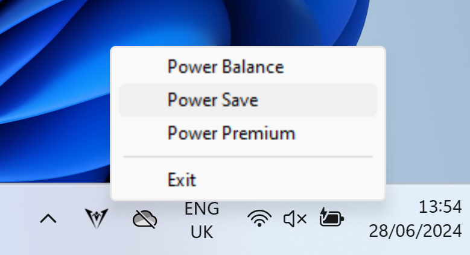

# v3tool

Extremely basic tray app for controlling power modes on the [Minisforum V3](https://www.minisforum.com/page/v3/index.html) without using Minisforum Space

Mostly written as Minisforum Space doesn't run on Windows 11 24H2 due to the [removal](https://techcommunity.microsoft.com/t5/windows-it-pro-blog/wmi-command-line-wmic-utility-deprecation-next-steps/ba-p/4039242) of `WMIC.exe`

## Requirements

v3tool uses the same underlying libraries to interact with the hardware as Minisforum Space

The following files should be copied from your existing Minisforum Space installation:

```
Minisforum Space
└── resources
    └── assets
        └── dll
            ├── minisforum.dll
            ├── WinRing0x64.dll
            └── WinRing0x64.sys
```

These files can be also extracted from the [official installer](https://www.minisforum.com/software/minisforum_space/update/win32/Minisforum%20Space%20Setup%201.0.4.exe) by opening the executable in 7-Zip and navigating to the `$PLUGINSDIR\app-64.7z\resources\assets\dll\` directory

## Usage

Copy the aforementioned files to the same directory as `v3tool.exe` and launch it

To start automatically on boot, navigate to the Startup folder (<kbd>Start+R</kbd> → `shell:startup`) and create a shortcut to the `v3tool.exe` executable - optionally with the `--dark` option for a light tray icon